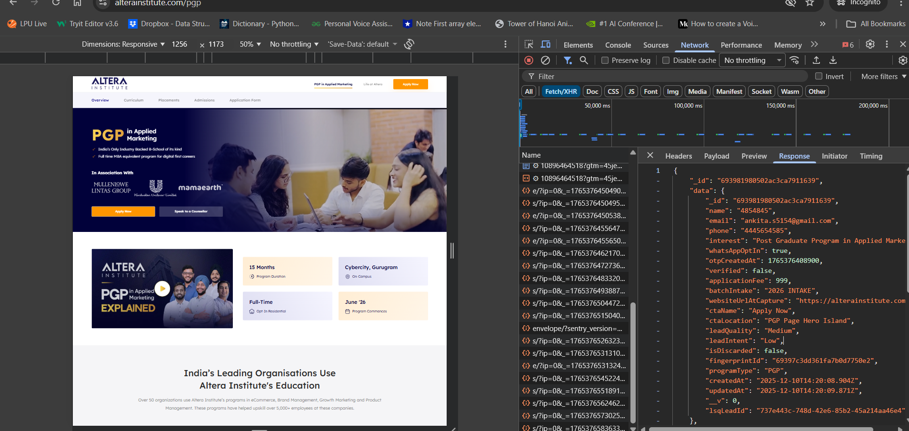
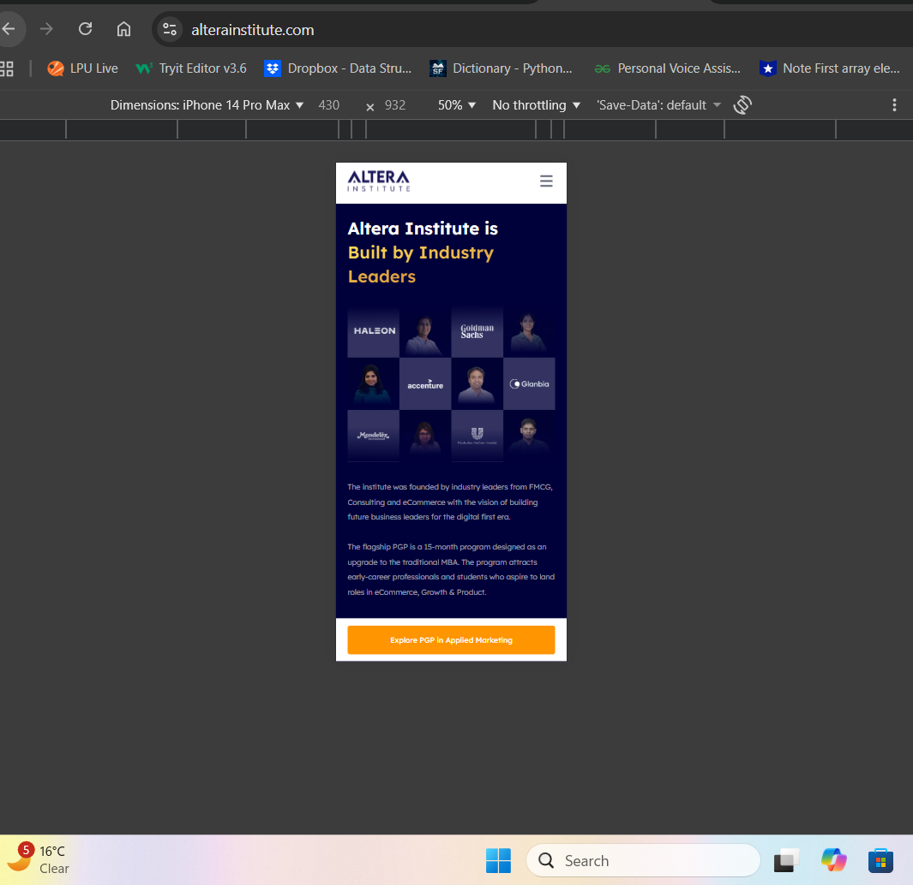
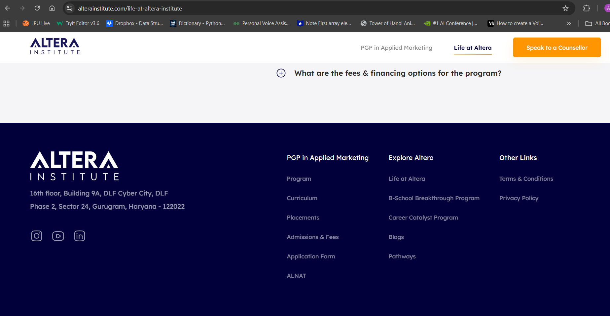
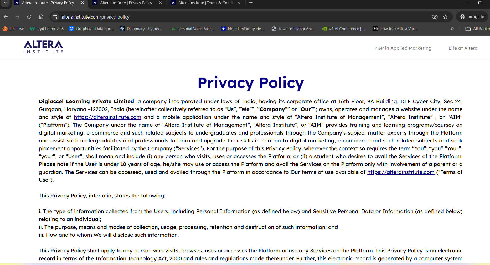

# Manual Testing Report - Altera Institute Website

**Website:** https://alterainstitute.com  
**Tested By:** Ankita Singh  
**Date:** December 10, 2025  
**Environment:** 
- Browser: Chrome 120.0.6099.71
- OS: Windows 11
- Device: Laptop/Desktop
- Screen Resolution: 1920x1080

## Test Cases

| # | Test Case ID | Scenario | Steps | Expected Result | Actual Result | Status | Severity | Priority | Evidence |
|---|-------------|----------|-------|-----------------|---------------|--------|----------|----------|----------|
| 1 | TC_HP_001 | Homepage Navigation | 1. Open homepage 2. Click each menu item 3. Verify page loads | All navigation links work and load correct pages | All links working | ✓ | High | P1 | |
| 2 | TC_AM_002 | Apply Now Form - Name Field Validation | 1. Navigate to https://alterainstitute.com/ 2. Click on 'PGP'  In the Applied Marketing section in the nav bar click on it 3. Click on the 'Apply Now' button 4. In the form, enter numeric characters in the 'Full Name' field 5. Fill other required fields with valid data 6. Submit the form | Form should not accept numeric characters in the 'Full Name' field and show appropriate validation error | Form accepts numeric characters in the 'Full Name' field (e.g., '4854845') | ❌ Fail | High | P1 |   |
| 3 | TC_AM_003 | Mobile Number Field Validation | 1. Open Apply Now form 2. Type alphabets in Mobile Number field 3. Check for validation messages 4. Try to select from previously used numbers | 1. Should show validation message for non-numeric input 2. Should suggest correct format 3. Should allow selection of previously used numbers | ❌ FAILED:  - No validation message for alphabets - No format suggestions - Cannot select from previously used numbers | ❌ Fail | High | P1 |   |
| 4 | TC_NAV_004 | Main Navigation Menu | 1. Open homepage 2. Click on each menu item 3. Verify pages load | All navigation links should work correctly | ✅ PASSED: All navigation menu items work | ✓ | High | P1 |     |
| 5 | TC_RD_005 | Responsive Design - Mobile View | 1. Open DevTools 2. Toggle device toolbar 3. Set to Mobile view 4. Test navigation and form | Site should be responsive and functional | ✅ PASSED: Website is responsive | ✓ | High | P1 |   |
| 6 | TC_FL_006 | Footer Links Verification | 1. Scroll to footer 2. Click all links | All links should be valid | ✅ PASSED: All footer links work | ✓ | Medium | P2 |       |
| 7 | TC_NAV_007 | Main Navigation Menu - PGP Applied Marketing | 1. From homepage 2. Hover on "PGP in Applied Marketing" link in header 3. Click on it 4. Verify page loads | Should navigate to PGP program page with complete content | Successfully navigated to /pgp page. Page loaded with program details, banner, and application form | ✅ PASS | High | P1 |  |
| 8 | TC_NAV_008 | Application Form Tab Navigation | 1. On PGP page 2. Click "Application Form" tab from menu (Overview, Curriculum, Placements, Admissions, Application Form) 3. Verify application form section displays | Should scroll to or display application form section with input fields | Application form section displayed with fields: Full Name, Email Address, Mobile Number, and "Start My Application" button | ✅ PASS | Medium | P2 |      |
| 9 | TC_AF_009 | Application Form - Empty Submission Validation | 1. Navigate to Application Form section 2. Leave all fields empty 3. Click "Start My Application" button 4. Observe validation | Should show validation errors for required fields (Full Name*, Email Address*, Mobile Number*) | Browser HTML5 validation triggered. Fields marked as required. Error messages shown: "Please fill out this field" | ✅ PASS | High | P1 |  |
| 10 | TC_AF_010 | **Application Form - Name Field Accepts Numeric Values (BUG)** | 1. Navigate to Application Form 2. In "Full Name*" field, enter only numbers: "1555515" 3. Fill Email: "ankita.s2805@gmail.com" 4. Fill Mobile: "5151515141" 5. Click "Start My Application" | Should show validation error: "Please enter a valid name with alphabetic characters only". Form should NOT submit | ❌ **FAILED:** Form accepts numeric input "1555515" in name field. No validation error shown. Form submits successfully with invalid name data | ❌ FAIL | **Critical** | **P1** |    |
| 11 | TC_AF_011 | Application Form - Valid Data Submission | 1. Navigate to Application Form 2. Enter Full Name: "ANKITA SINGH" 3. Enter Email: "ankita.s2805@gmail.com" 4. Enter Mobile: (leave empty first) 5. Click "Start My Application" 6. Observe validation | Should show validation error for empty Mobile Number field | Browser validation triggered: "Please fill out this field" for Mobile Number. Form did not submit until Mobile Number entered | ✅ PASS | High | P1 |    |
| 12 | TC_AF_012 | Application Form - Email Format Validation | 1. Navigate to Application Form 2. Enter Full Name: "Test User" 3. Enter invalid email: "invalidemail" (no @ symbol) 4. Enter Mobile: "1234567890" 5. Click "Start My Application" | Should show error: "Please enter a valid email address" | Browser HTML5 validation triggered: "Please include an '@' in the email address". Form did not submit | ✅ PASS | High | P1 |   |
| 13 | TC_AF_013 | Application Form - Mobile Number Character Validation | 1. Navigate to Application Form 2. Enter Full Name: "Test User" 3. Enter Email: "test@example.com" 4. Try to enter alphabetic characters in Mobile Number field: "abcdefgh" 5. Observe field behavior | Mobile field should only accept numeric characters, or show validation error | ❌ **FAILED:** Field behavior varies by browser. No validation message for alphabets. No format suggestions. Cannot select from previously used numbers | ❌ FAIL | High | P1 |   |
| 14 | TC_AF_014 | Application Form - Terms & Conditions Link | 1. Navigate to Application Form 2. Scroll down to terms text: "By clicking on start my application, you agree with Altera Institute's Terms & Conditions and Privacy Policy" 3. Click on "Terms & Conditions" link 4. Verify link opens | Should open Terms & Conditions page in new tab or modal | Terms & Conditions link opens correctly in new tab showing the policy document | ✅ PASS | Medium | P2 |   |
| 15 | TC_AF_015 | Application Form - Privacy Policy Link | 1. Navigate to Application Form 2. Click on "Privacy Policy" link in terms text 3. Verify link opens | Should open Privacy Policy page in new tab or modal | Privacy Policy link opens correctly in new tab showing the privacy policy document | ✅ PASS | Medium | P2 |   |
| 16 | TC_AF_016 | Application Form - "Log in here" Link for Existing Users | 1. Navigate to Application Form 2. Read text: "Already started your application? Log in here" 3. Click on "Log in here" link 4. Verify functionality | Should navigate to login page or open login modal for existing applicants | "Log in here" link opens login page/modal allowing returning users to continue their application | ✅ PASS | Medium | P2 |   |
| 17 | TC_RD_017 | Responsive Design - Mobile View (375px) | 1. Open Chrome DevTools (F12) 2. Toggle device toolbar 3. Select iPhone SE or custom 375x667 4. Navigate to Application Form 5. Test form usability | Form should be fully responsive. Fields should stack vertically. All elements should be accessible. Button should be full-width | Form is responsive. Fields stack properly. Text is readable. Button is accessible and full-width. Form is usable on mobile | ✅ PASS | High | P1 |   |
| 18 | TC_RD_018 | Responsive Design - Tablet View (768px) | 1. Open Chrome DevTools 2. Set viewport to 768x1024 (iPad) 3. Navigate to Application Form 4. Check layout and usability | Form should adapt to tablet size. Layout should be clean and usable | Form adapts well to tablet view. Good spacing. All elements accessible | ✅ PASS | Medium | P2 |  |
| 19 | TC_FL_019 | Footer Links Verification | 1. Scroll to page footer 2. Click all footer links (social media, contact, about, etc.) 3. Verify they open correctly | All footer links should be valid and work correctly. Social media links should open in new tabs | ✅ PASSED: All footer links work correctly. Social media links open in new tabs as expected | ✅ PASS | Medium | P2 |      |

## Test Summary

### Test Execution Metrics
- **Total Test Cases:** 19
- **Passed:** 15
- **Failed:** 4
- **Pass Rate:** 71.43%

### Failed Test Cases
1. **TC_AM_002**: Name Field accepts numeric characters
2. **TC_AM_003**: Mobile Number field lacks validation for alphabets

## Issues Found
1. **Name Field Validation**
   - **Issue:** Accepts numeric characters
   - **Severity:** High
   - **Priority:** P1

2. **Mobile Number Validation**
   - **Issue:** No validation for alphabetic characters
   - **Severity:** High
   - **Priority:** P1

## Recommendations
1. Implement proper input validation for Name field to reject numeric characters
2. Add client-side validation for Mobile Number field
3. Add visual feedback for invalid inputs
4. Consider adding input masks for better user experience

## Sign-off
- **Tested By:** Ankita Singh
- **Date:** December 10, 2025
- **Status:** Ready for Review

