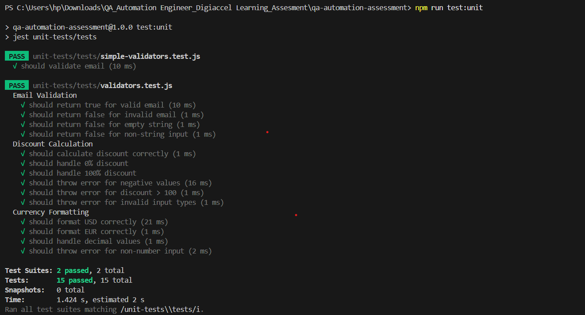
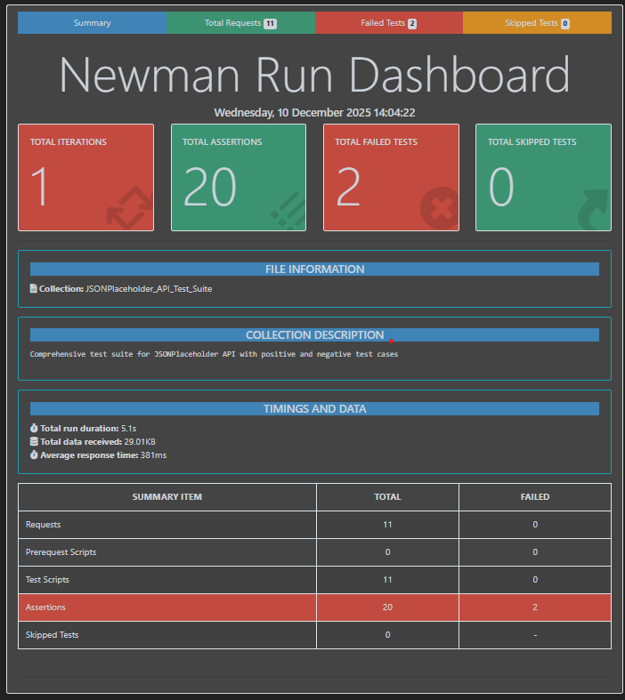

# QA Automation Assessment

Comprehensive QA automation test suite covering manual testing, UI automation, API automation, unit testing, and E2E testing.

## **Assessment (Attached)**

- **File:** `QA Automation Engineer - Assessment.pdf`
- **Summary:** The attached assessment contains the full question set and acceptance criteria you were assigned. It focuses on implementing and validating a comprehensive QA automation solution covering:
  - UI automation (Playwright) 
  - API automation (Postman/Newman) 
  - Unit testing (Jest) 
  - End-to-end scenarios and test reporting
- **What to do next:** Open the attached PDF to read the full task descriptions and acceptance criteria. Use the existing test structure in this repo to implement the required tests, then run and attach the generated reports.


## 📁 Project Structure

```
qa-automation-assessment/
├── ManualTesting.md
├── ui-tests/
│   ├── pages/
│   ├── tests/
│   └── playwright.config.js
├── api-tests/
│   ├── collections/
│   └── reports/
├── unit-tests/
│   ├── utils/
│   └── tests/
├── e2e-tests/
│   └── tests/
├── package.json
└── README.md
```

##  Setup Instructions

### Prerequisites
- Node.js (v16 or higher)
- npm
- Git
- Postman (for API test creation)

### Installation

1. Clone the repository:
```bash
git clone <your-repo-url>
cd qa-automation-assessment
```

2. Install dependencies:
```bash
npm install
npx playwright install
npm install -g newman newman-reporter-htmlextra
```

## Running Tests

### UI Tests (Playwright)
```bash
# Run all UI tests
npm run test:ui

# Run specific test file
npx playwright test ui-tests/tests/login.spec.js

# Run with UI mode
npx playwright test --ui

# View HTML report
npx playwright show-report

```

### API Tests (Newman)
```bash
# Run API tests
npm run test:api

# View report: open api-tests/reports/api-test-report.html in browser
```

### Unit Tests (Jest)
```bash
# Run unit tests
npm run test:unit

# Run unit tests with coverage
npm run test:coverage
```

### E2E Tests
```bash
# Run E2E tests
npm run test:e2e

# Run with headed browser
npx playwright test e2e-tests/tests --headed
```

## Test Coverage

- **Manual Testing**: 12 test cases
- **UI Automation**: 6 test cases
- **API Automation**: 9 API endpoints with multiple assertions
- **Unit Testing**: 3 utility functions with 15+ test cases



**Coverage Summary:**
- **Statements**: 100%
- **Branches**: 100%
- **Functions**: 100%
- **Lines**: 100%


- **E2E Testing**: Complete purchase flow for the SauceDemo application using Playwright.
1. **Login as standard_user**
   - Navigates to login page
   - Enters valid credentials
   - Verifies successful login

2. **Add Items to Cart**
   - Adds two specific products to cart
   - Verifies cart badge count updates

3. **Checkout Flow**
   - Navigates to cart
   - Proceeds to checkout
   - Fills in shipping information
   - Verifies order summary
   - Completes purchase
   - Verifies order confirmation
   - Returns to products page

##  Technologies Used

- **UI Testing**: Playwright with JavaScript
- **API Testing**: Postman + Newman
- **Unit Testing**: Jest
- **Design Pattern**: Page Object Model (POM)
- **CI/CD Ready**: All tests can run in CI/CD pipelines

## Test Reports

### UI Testing Report

*Interactive HTML report available at: `playwright-report/index.html`*

### API Testing Reports

#### Newman Test Runner Dashboard


#### Detailed API Test Results


### E2E Test Complete Purchase Flow


### Detailed Test Execution


### Other Reports
- **UI Tests**: `playwright-report/index.html`
- **API Tests**: `api-tests/reports/api-test-report.html
- **Unit Tests**: `coverage/lcov-report/index.html` + coverage report

##  Author

[Ankita Singh]  
[ankita.s2805@gmail.com]  
[9/12/2025]

##  License

This project is for assessment purposes only.
